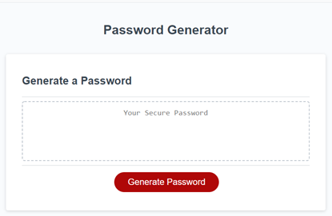
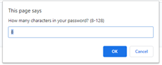
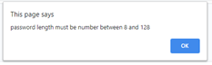
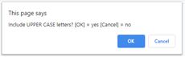

# 03-JavaScript-Password-Generator
Due Date: 2/10/2021 @ 11:59 PM

1st Javascript assignment
# links 
* https://www.rapidtables.com/code/text/ascii-table.html
* https://owasp.org/www-community/password-special-characters
* https://docs.google.com/spreadsheets/d/17oWPJ3x0biuTS77ADcNflrXFdUI-YjPXpGfeJ3DG5m8/edit#gid=0
* https://www.w3schools.com/jsref/jsref_fromcharcode.asp
* https://www.w3schools.com/js/js_loop_while.asp
* https://www.w3schools.com/js/js_const.asp
https://www.w3schools.com/jsref/jsref_concat_array.asp
https://gomakethings.com/whats-the-best-way-to-document-javascript/
https://developer.mozilla.org/en-US/docs/Web/JavaScript/Reference/Template_literals

# 2: Responsive Portfolio
Due Date: 2/3/2021 @ 11:59 PM

Coding Bootcamp Homework Assignment #2
# 02 Advanced CSS: Portfolio
The primary objectives of this exercise were to demonstrat the use of the following:

* flexbox
* media queries
* CSS variables

# References / resources 

* https://pngtree.com/free-backgrounds
* https://dummyimage.com/
* https://coolors.co/

## Screenshots
### Screen 1: **Initial Screen**

* When you click the Generate Password (which the click is captured by the `.addEventListener` on the `generateBtn`) the main process of generating the password initiates (that is, we're waiting for a `click` action in the `generateBtn.addEventListener` and once we get that click we fire the function `writePassword()`)  

        generateBtn.addEventListener("click", writePassword);

* `writePassword()` fires `generatePassword()` which is *where the party is!* (the majority of the work on this homework was done here.  Returns `password` variable.

### Screen 2: **Enter the length of the password bnetween 8 and 128**

* we perform some basic checking to ensure the user has entered a value between `passwordMinLength` and `passwordMaxLength`;
    
### Screen 3: **Failed range check**

* Here's the feedback on the failed range check.  Items to note here - It seemed if I insisted on using  `passwordMinLength` and `passwordMaxLength` as `const` variables, I should consistently use these not just on logic checks but on user feedback.  At first I created the window.prompt piecing things together:

#### My Line 

    passwordLength = window.prompt("How Many characters in your password? (" + passwordMinLength + "-" + passwordMaxLength +")",12);

I thought that looked bad, and so did Visual Studio Code - which recommended I consider using a [template string](https://developer.mozilla.org/en-US/docs/Web/JavaScript/Reference/Template_literals), so I did!

#### New Line 

    window.prompt('How many characters in your password? (${passwordMinLength}-${passwordMaxLength})',12);

Kinda scratchin my head on the `'` vs `"` but whatever.

### Screen 4: **Failed range check**

## Links
* This repo is located [on github](https://github.com/jonesjsc/2-Responsive-Portfolio)
* This site is deployed on [github pages](https://jonesjsc.github.io/2-Responsive-Portfolio/)